# Deep Learning: Traffic-Sign-Classifier-Project

## Michael DeFilippo

### This project was used to introduce the concepts of using Tensorflow and the Python programming language to build a German traffic sign classifier based on a LeNet-5 convolutional network (CovNet). Once the CovNet was trained on a data set of German traffic signs I was able to test this on a validation dataset and a test dataset to test my classifiers accuracy. Furthermore I tested this CovNet on six randomly selected German traffic signs that I downloaded from Google Images. 

#### Please see my [project code](https://github.com/mikedef/Traffic-Sign-Classifier-Project/blob/master/Traffic_Sign_Classifier.ipynb) for any questions regarding implimentation. 
---

### Data Set Summary & Exploration

#### 1. Provide a basic summary of the data set

I used the numpy and pandas library to calculate summary statistics of the traffic signs data set:

    The size of training set is 34799 images. 
    The size of the validation set is 4410 images.
    The size of test set is 12630 images.
    The shape of a traffic sign image is (32, 32).
    The number of unique classes/labels in the data set is 43.

I was able to also view the sign labels after reading in the signnames.csv with the pandas library. This was useful as I was able to see what each class name was supposed to be labeled as. 

#### 2. Include an exploratory visualization of the dataset

Here is an exploratory visualization of the data set. It is a bar chart showing how the images are distributed across the 43 classes. 

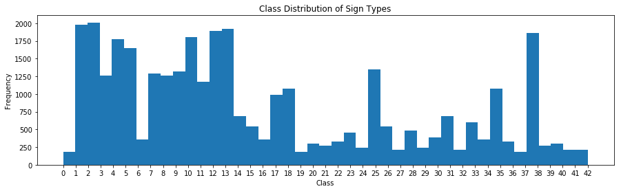

The distribution is far from perfect. With some classes having greater than 2000 images and others having less than 250 images to train, validate and test on. This is far from ideal when training data. Further exploration of this problem might include creating modified images of the classes that are lower in number to help increase the data to work with. 

### Design and Test a Model Architecture

#### 1. For preprocessing the data I first converted the images to grayscale because there was not much of a difference in accuracy for training the CovNet vs time to train the CovNet with the RGB data intact. I then normalized the images so that the data has mean zero and equal variance. See the examples below to visualize the process. 

Original Image

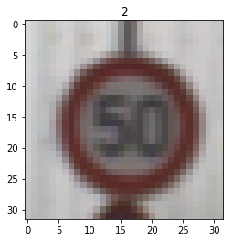

Grayscale Image

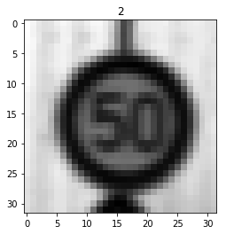

Normalized Image

#### 2. The final model architecture was based on a LeNet-5 CovNet.

My final model consisted of the following layers:

| Layer         		|     Description	        					| 
|:---------------------:|:---------------------------------------------:| 
| Input         		| 32x32x1 Grayscale image						| 
| Convolution 5x5     	| 1x1 stride, valid padding, outputs 28x28x6 	|
| RELU					| Activation									|
| Max pooling	      	| 2x2 stride,  outputs 14x14x6				    |
| Convolution 5x5	    | 1x1 stride, valid padding, outputs10x10x16	|
| RELU					| Activation									|
| Max pooling	      	| 2x2 stride,  outputs 5x5x16				    |
| Fully connected		| Input = 400. Output = 120        				|
| RELU					| Activation									|
| Dropout				| keep_prob = 0.6  								|
| Fully connected		| Input = 120. Output = 84        				|
| RELU					| Activation									|
| Dropout				| keep_prob = 0.6  								|
|						|												|
|						|												|

#### 3. Describe how you trained your model

I set the following Hyperparameters:

    EPOCHS = 20
    BATCH_SIZE = 128
    rate = 0.0005
   
The following pipeline was used to train the model:

    logits = LeNet(x)
    cross_entropy = tf.nn.softmax_cross_entropy_with_logits(labels=one_hot_y, logits=logits)
    loss_operation = tf.reduce_mean(cross_entropy)
    optimizer = tf.train.AdamOptimizer(learning_rate = rate)
    training_operation = optimizer.minimize(loss_operation)
    
#### 4. Model Validation

My final model results were: 

    Train Accuracy = 0.993
    Valid Accuracy = 0.951
    Test Accuracy = 0.925
    
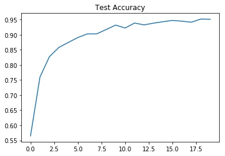
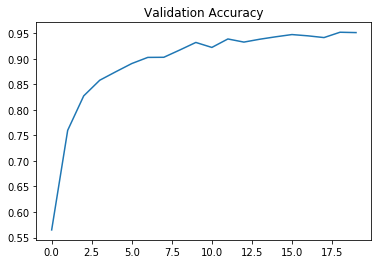

### Test a Model on New Images

#### 1. Choose additional German traffic signs found on the web and provide them in the report.

Here are additional German traffic signs that I found on the web:

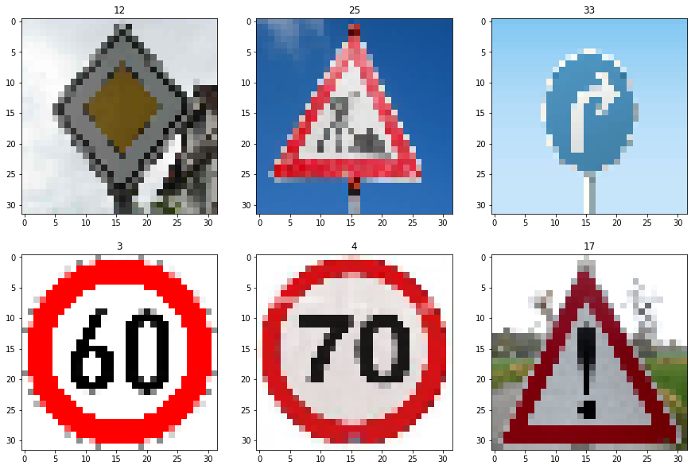

#### 2. Results of the models predictions on new traffic signs

Here are the results of the prediction:

| Image			        |     Prediction	        					| 
|:---------------------:|:---------------------------------------------:| 
| Priority road     	|   Priority road								| 
| Road work     		|  	Road work									|
| Turn right ahead		| 	Ahead only									|
| Speed limit (60km/h)	| 	Speed limit (60km/h)		 				|
| Speed limit (70km/h)	|   Speed limit (30km/h)						|
| General caution       |   General caution  							|

The model was able to correctly guess 4 of the 6 traffic signs, which gives an accuracy of 67%. This compares does not compare favorably to the accuracy on the test set of the original images. 

#### 3. Certainty of the model for each prediction

For the first image, the model is certain that this is a priority road sign, and the image is of the priority road sign. 

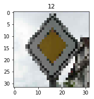

| Probability         	|     Prediction	        					| 
|:---------------------:|:---------------------------------------------:| 
| .99         			| Priority road   									| 
| .00     				| Roundabout mandatory 										|
| .00					| End of no passing											|
| .00	      			| End of all speed and passing limits					 				|
| .00				    | End of no passing by vehicles over 3.5 metric tons      							|

    Probabilities: [  9.99927044e-01   7.28167506e-05   1.62603854e-07   5.11710390e-08   2.82572827e-08] 
    Predicted classes: [12 40 41 32 42]

For the second image, the model is certain that this is a Road work sign, and the image is of the road work sign. 

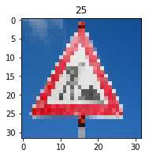

| Probability         	|     Prediction	        					| 
|:---------------------:|:---------------------------------------------:| 
| .99         			| Road work   									| 
| .00     				| Bicycles crossing									|
| .00					| Dangerous curve to the left											|
| .00	      			| Road narrows on the right					 				|
| .00				    | Wild animals crossing      							|

    Probabilities: [  9.96245921e-01   1.92384352e-03   6.28800888e-04   5.11999708e-04   5.04457217e-04] 
    Predicted classes: [25 29 19 24 31]
    
For the third image, the model is not correct in predicting the image of a turn right ahead sign. The model only has a gives a 2% chance to the correct classification.

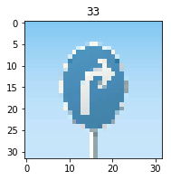

| Probability         	|     Prediction	        					| 
|:---------------------:|:---------------------------------------------:| 
| .66         			| Ahead only   									| 
| .22     				| Turn left ahead									|
| .08					| Right-of-way at the next intersection											|
| .02	      			| Turn left ahead					 				|
| .01				    | Children crossing      							|

    Probabilities: [ 0.65927112  0.22715113  0.0839253   0.01635204  0.00930295] 
    Predicted classes: [35 34 11 33 28]
    
For the fourth image, the model is certain that this is a speed limit 60 km/h sign, and the image is of the speed limit 60 km/h sign. 

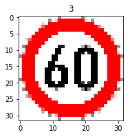

| Probability         	|     Prediction	        					| 
|:---------------------:|:---------------------------------------------:| 
| .97         			| Speed limit (60km/h)   									| 
| .02     				| Speed limit (50km/h)									|
| .01					| Wild animals crossing											|
| .00	      			| Right-of-way at the next intersection					 				|
| .00				    | Slippery road      							|

    Probabilities: [ 0.9684208   0.02025548  0.00403585  0.00261327  0.00212481] 
    Predicted classes: [ 3  2 31 11 23]
    
For the fifth image, the model is not correct in predicting the image of a speed limit 70 km/h sign. The model only has a gives a 7% chance to the correct classification.

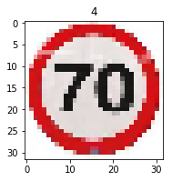

| Probability         	|     Prediction	        					| 
|:---------------------:|:---------------------------------------------:| 
| .34         			| Speed limit (30km/h)  									| 
| .23     				| Speed limit (20km/h)								|
| .15					| General caution											|
| .07	      			| Speed limit (70km/h)					 				|
| .05				    | Speed limit (80km/h)      							|

    Probabilities: [ 0.34442198  0.23370315  0.15479192  0.07132448  0.05108599] 
    Predicted classes: [ 1  0 18  4  5]
    
For the sixth image, the model is certian that this is a general caution sign, and the image is of the general caution sign. 

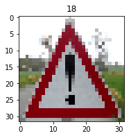

| Probability         	|     Prediction	        					| 
|:---------------------:|:---------------------------------------------:| 
| .99         			| General caution   									| 
| .01     				| Pedestrians									|
| .00					| Traffic signals											|
| .00	      			| Right-of-way at the next intersection					 				|
| .00				    | Road narrows on the right      							|

    Probabilities: [  9.91901934e-01   6.01758901e-03   2.07480928e-03   5.42416728e-06   1.30891635e-07] 
    Predicted classes: [18 27 26 11 24]

### New Image Discussion

The new images for testing as shown above were evaluated with a prediction accuracy of 50%. There are a few problem with the predictions on these images. The problems may arise due to the image quality. Another issue that I see is that some of the signs are not straight in the image. out of the three incorrectly classified images the correct classification is within the top five probabilities in two of the misclassified images. In the last image the classifier does not even classify within the top five probabilities.

I think that increasing the amount of test images will help with the predictions. In particular I think that using the same images, but modifying the images such that they are distorted, blurred, and off axis will help with these misclassifications in particular.
